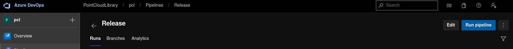
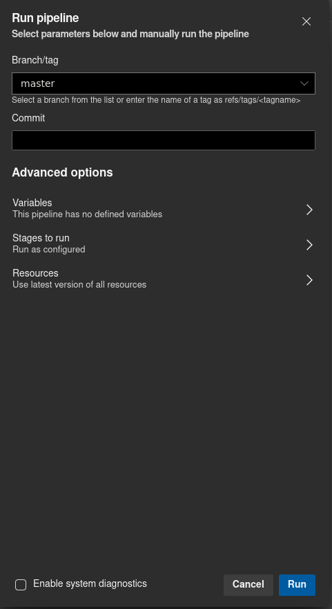
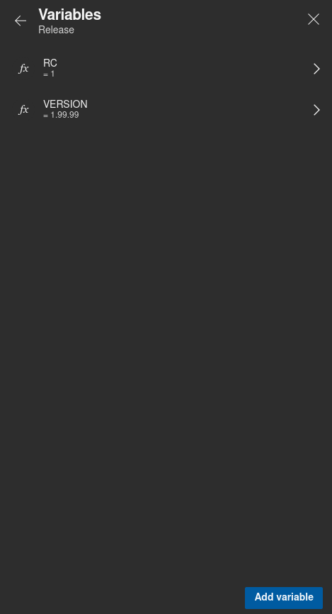
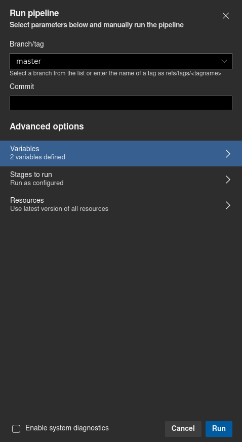

# Table of Contents

- [Task list](#task-list)
- [Creating the Change Log](#creating-the-change-log)
- [Running the release pipeline](#running-the-release-pipeline)
- [Shipping Binaries](#shipping-binaries)
- [Generating Documentation](#generating-documentation)

# Task list
- [ ] Go through all PR for the milestone
- [ ] Create a pre-release via the release pipeline
- [ ] (If needed) Revert whatever unintentional API/ABI breakage that might have occurred in the release branch
- [ ] Once pre-release has fixed all issues, get ready for a release
- [ ] Update Changelog
- [ ] Bump version via `.dev/scripts/bump_release.bash X.Y.Z`
- [ ] Commit, push, merge and run the release pipeline again
- [ ] Send announcements to the community forums
- [ ] Fetch all tags from PCL's repository
- [ ] Run `.dev/scripts/bump_post_release` to bump version again
- [ ] Commit, push and merge
- [ ] Throw a party!

# Creating the Change Log

`.dev/scripts/generate_changelog.py` is a Python3 script which generates a markdown Change Log between the last released version and the current commit.

The generated log lists the most important changes first, like new features and API changes among others, and then proceeds to provide an extensive change list for each individual module.

In order to generate a meaningful change log, we make use of Pull Requests' (PR) metadata such as id, title and labels. There are two important label groups with the following prefixes: `module: ` and `changelog: `.

- `module: ` Module tags provide an organization of PRs in terms of the libraries modules. We also include some extra labels which are not exactly library modules per se, for instance things related to CI and CMake, but that are convenient to appear in their own section in the produced log.
- `changelog: ` Changes tags are used to flag important API/ABI/behavior changes introduced by PRs.

It's also important to mention the `new feature` label which is used to highlight new features at the top of the summary.

There's currently no support for the `platform: ` prefix in labels, although it could be extended in the future if the need for it arises.

## Dependencies

The tool has a few 3rd party dependencies:
- `argparse` - a Python library which simplifies handling flags from CLI, available through PyPi.
- `requests`- a Python library which simplifies handling authenticated requests to fetch PR data from GitHub's API, available through PyPi. [Website](http://docs.python-requests.org/en/master/).

## Usage

```
# Most important changes
$ .dev/scripts/generate_change.py

# All changes
$ .dev/scripts/generate_change.py --with-misc
```

### Authenticated Request

The script leverages the capabilities of the [GitHub REST API](https://developer.github.com/v3/) to fetch all necessary PR information. The API is free to use but imposes a hourly request rate limit for anonymous requests. This limit is too low to allow fetching the usual amount of data required when generating a change log between contiguous PCL releases. Performing user authenticated requests raises this limit but requires a GitHub account.

To use the GitHub authentication, the facility needs to be added to the script

### Caching PR Data

Fetching PR data from GitHub is not exactly slow but also not exactly fast. In conjunction with the request rate restrictions, it made it worthwhile to cache the PR data fetched into a file. This is arguably only relevant for development purposes. Specifying the option `--cache` makes the script serialize all the data to a JSON file. If the cache is used no request are made to GitHub.

```
# Save PR data from a file
$ .dev/scripts/generate_change.py --save FILENAME
```
To later read from the cache file simply use:
```
# Load PR data from a file
$ .dev/scripts/generate_change.py --load FILENAME
```

# Running the Release Pipeline

0. You need access to the PointCloudLibrary organization on Azure.
1. Navigate to the view with all pipelines. [Link](https://dev.azure.com/PointCloudLibrary/pcl/_build?view=folders)


2. Find the `Run Pipeline` button for the Release pipeline



3. In the dialog, choose the correct branch/commit to run the pipeline on



4. Set the `RC` (release candidate) and `VERSION` appropriately. `VERSION` should be in semver format, while `RC` should be 0 for a release and non-zero for alpha releases



5. All ready to go. Press `Run` and sit back to get the binaries released. New release will be visible on `https://github.com/PointCloudLibrary/pcl/releases` if you're logged in



6. Complete the draft and publish it
7. Tag is created automatically for you

# Shipping Binaries
## Mac OSX
Ship only modules enabled by default. Assume only the following optionals: existence of VTK and OpenGL support

* Go to CMakeLists.txt and comment out
  * all section regarding RPATH setup (we should allow this to be specified with CMAKE)
  * `find_package (OpenMP)`
* Configure (Replace `<macOS_Major_Version>` with the macOS version you want to build for e.g. 10.15
```shell
$ cmake .. -DCMAKE_OSX_SYSROOT="/Library/Developer/CommandLineTools/SDKs/MacOSX<macOS_Major_Version>.sdk" \
           -DCPACK_GENERATOR="TBZ2" \
           -DCPACK_PACKAGE_FILE_NAME="pcl-1.x.x-darwin" \
           -DCMAKE_BUILD_TYPE=Release \
           -DPCL_ENABLE_SSE=OFF \
           -DWITH_CUDA=OFF \
           -DWITH_DAVIDSDK=OFF \
           -DWITH_DOCS=OFF \
           -DWITH_DSSDK=OFF \
           -DWITH_ENSENSO=OFF \
           -DWITH_FZAPI=OFF \
           -DWITH_LIBUSB=OFF \
           -DWITH_OPENGL=ON \
           -DWITH_OPENNI=OFF \
           -DWITH_OPENNI2=OFF \
           -DWITH_PCAP=OFF \
           -DWITH_PNG=OFF \
           -DWITH_QHULL=OFF \
           -DWITH_QT=OFF \
           -DWITH_RSSDK=OFF \
           -DWITH_VTK=ON
$ make -j package
# and pray your system doesn't run out of memory
```

# Generating Documentation

In the steps below replace VERSION with the actual release version.

Check out the release tag, configure, and build documentation:

```shell
$ git checkout pcl-VERSION
$ cmake .. -DWITH_DOCS=ON 
$ make doc
```

Archive and send to the server:

```shell
$ cd doc/doxygen
$ tar -zcf docs.tgz html
$ scp docs.tgz pointclouds:/var/www/docs.pointclouds.org/
```

Unpack on the server and edit documentation index page to include a link:

```shell
$ cd /var/www/docs.pointclouds.org
$ tar xzf docs.tgz && rm docs.tgz
$ mv html VERSION
$ vim /var/www/pointclouds.org/documentation/index.php
```
